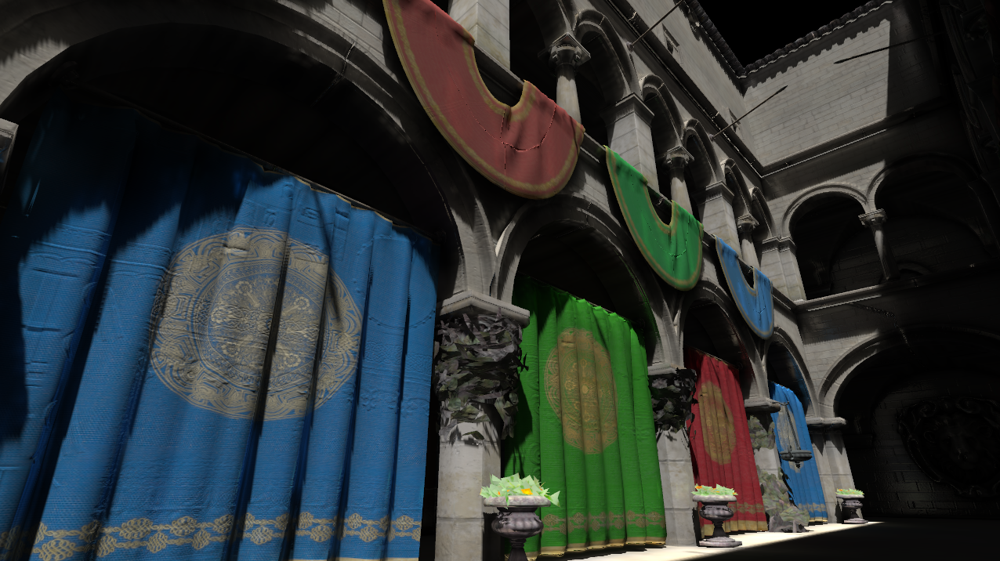

本项目是对经典全局光照算法VXGI(Voxel Global Illumination)的实现。全局光照的计算中包含了直接光照、间接漫反射光、间接镜面反射光三部分，其中间接光照的计算利用了3D纹理存储的场景体素化结构。同时本项目中还支持了环境光遮蔽(Ambient Occlusion)和PCSS(Percentage-Closer Soft Shadows)软阴影，具备不错的最终效果。
## 如何运行
本项目要求Windows操作系统下已安装Visual Studio和CMake。
1. 通过git clone拉取仓库：https://github.com/ZJU-Lv/VXGI-Renderer.git
2. 打开命令行，进入内层VXGI-Renderer文件夹（包含有CMakeLists.txt的那层）。
3. 运行命令：mkdir build \&\& cd build
4. 运行命令：cmake ..
5. 进入build文件夹，双击打开sln文件。
6. 在Visual Studio中，设置"Renderer"为启动项目。
7. 编译运行。
## 操作指南
运行程序后，通过"W""A""S""D""Q""E"键可以控制摄像机的前后左右上下移动。鼠标可以控制视角的转动。  
默认渲染全局光照模式。  
按下"1"键，控制打开/关闭直接光照；  
按下"2"键，控制打开/关闭间接漫反射光；  
按下"3"键，控制打开/关闭间接镜面反射光；  
按下"4"键，控制打开/关闭环境光遮蔽渲染模式，这种模式下场景的AO会作为颜色值渲染出来；  
按下"5"键，控制打开/关闭体素化渲染模式，这种模式下会渲染3D纹理存储的体素化结果。  
## 场景演示
1. 全局光照

2. 直接光照

3. 间接漫反射光

4. 间接镜面反射光

5. AO

6. 体素化

## 参考文献
[Interactive Indirect Illumination Using Voxel Cone Tracing](https://research.nvidia.com/sites/default/files/publications/GIVoxels-pg2011-authors.pdf)

[Deferred Voxel Shading for Real Time Global Illumination](https://jose-villegas.github.io/post/deferred_voxel_shading/)
